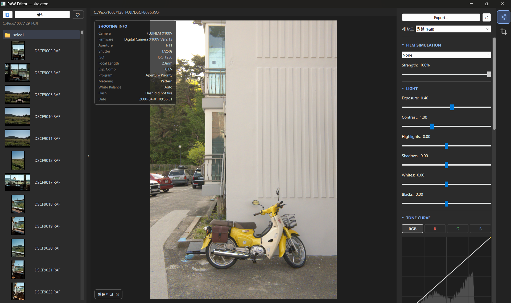

# Film Rawstery


-EB0A1E)


A GPU-accelerated RAW developer and film-simulation editor for the **Fujifilm X100V** (`.RAF`), built with **PySide6 (QML) + GLSL shaders**.

Edit interactively on a real-time, shader-driven preview, then export at full resolution through a numpy pipeline that mirrors the shader exactly — *what you see is what you get*.

<p align="center">
  
</p>

> ⚠️ Tuned specifically for the Fuji X100V (X-Trans sensor + lens profile). Other cameras may decode but won't match the lens/color tuning.

---

## Features

### Develop
- **Scene-linear + filmic** tone pipeline — physically-grounded base render with a single highlight-rolloff tone curve (no per-scene heuristics)
- **White balance** — absolute Kelvin + tint via the Planckian locus, with as-shot estimation for off-locus illuminants
- **Light** — exposure (scene-linear stops), contrast, highlights / shadows / whites / blacks (Lightroom-style local tone zones)
- **Tone curve** — Catmull-Rom editor with **per-channel RGB** curves (master + R/G/B) for color grading
- **HSL color mixer** — 8 hue bands × hue / saturation / luminance
- **Color** — vibrance & saturation
- **Detail** — texture, clarity, dehaze, and **sharpening** (amount / radius / detail / masking)
- **Effects** — film grain, vignette
- **Highlight reconstruction** — hue-aware desaturation that neutralizes clipped-highlight color casts (e.g. a fire core) while preserving saturated colored light sources (neon, signs)

### Film Simulations
12 Fujifilm looks as 3D LUTs: Provia, Velvia, Astia, Classic Chrome, Classic Negative, Nostalgic Neg, PRO Neg. Hi/Std, Eterna, Reala Ace, Bleach Bypass — with adjustable strength.

### Geometry
Crop (aspect-ratio presets + free drag), rotate / straighten, flip, and perspective (vertical / horizontal keystone + scale) — applied identically in preview and export.

### Lens Corrections
Built-in X100V profile: distortion, vignetting, and chromatic aberration.

### Workflow
- **Before / After compare** — toggle the unedited original (button or `\` key)
- **Undo / redo** — snapshot history of all adjustments (`Ctrl+Z` / `Ctrl+Shift+Z`)
- **Non-destructive, per-image persistence** — edits autosave to a `.camrawedits/<file>.json` sidecar and restore when you reopen the image
- **File explorer** with RAF thumbnails and a likes/favorites filter
- **Film date stamp** — DSEG7 seven-segment date back overlay
- **Live histogram** reflecting current adjustments
- **Full-resolution export** to JPEG / PNG / TIFF (background-threaded, UI stays responsive)

---

## How it works

```
RAF ──rawpy──► camera-native proxy (≤2560px, headroom-encoded)
                     │
       QML ShaderEffect pipeline (GPU, proxy-resolution FBO → scaled to screen)
       headroom-decode → WB → cam→sRGB matrix → ×2^exposure → filmic
       → tone zones → texture/clarity/dehaze → sharpen → film-sim LUT
       → vibrance/sat → HSL mixer → contrast → tone curve → vignette → grain
                     │
   live preview (GPU)        Export: pipeline.py (full-res numpy, same steps)
```

Key design decisions:
- **Processing resolution ≠ display resolution** — the pipeline always renders at a fixed proxy resolution and scales to screen, so GPU load is independent of monitor size.
- **Preview = Export parity** — the GLSL shaders (`shaders/adjust.frag`) and the numpy export (`pipeline.py`) implement the same steps, formulas, and coefficients.
- **Color science first, look-matching second** — algorithms are physically/colorimetrically correct; strengths and curves are then tuned to feel like Adobe Lightroom.

---

## Requirements

- Python 3.13 (3.11+ should work)
- `PySide6`, `rawpy`, `numpy`, `scipy`, `exifread` (see [`requirements.txt`](requirements.txt))
- A GPU/driver supporting the Qt RHI (OpenGL / Direct3D / Metal / Vulkan)

## Install & Run

```bash
pip install -r requirements.txt
python main.py
```

Open a `.RAF` from the left file explorer (double-click). Shaders auto-recompile from `shaders/*.frag` on launch when changed.

---

## Project structure

| Path | Role |
|------|------|
| `main.py` | App entry point, controller, image providers (raw / lut / curve / stamp / thumb) |
| `raw_loader.py` | RAF → display proxy (X-Trans-safe decode, headroom encoding, lens correction) |
| `pipeline.py` | Full-resolution export — numpy reproduction of the shader pipeline |
| `wb.py` | White balance (Kelvin/tint), cam→sRGB matrix, filmic curve, auto-exposure |
| `lens.py` | X100V lens profile (distortion / vignetting / CA) |
| `lut.py`, `make_luts.py` | `.cube` 3D LUT loading / baking |
| `date_stamp.py`, `exif_info.py` | Film date-back rendering / EXIF extraction |
| `Main.qml`, `CurveEditor.qml`, `PreviewWindow.qml` | UI |
| `shaders/adjust.frag` | Main develop pipeline (fragment shader) |
| `shaders/blur.frag`, `shaders/convert.frag` | Separable blur (local contrast) / display-space base |
| `luts/*.cube` | Film-simulation LUTs |

---

## Credits

- **Color film-simulation LUTs** — derived from the *FujifilmCameraProfiles* project (sRGB `.cube`)
- **B&W film-simulation LUTs** (ACROS / Monochrome / Sepia) — [Stuart Sowerby](https://blog.sowerby.me/fuji-film-simulation-profiles/) (Fuji X-Trans III, converted from `.3dl` to N=32 `.cube`)
- **Date-back font** — [DSEG](https://github.com/keshikan/DSEG) by Keshikan (SIL Open Font License 1.1)
- **RAW decoding** — [rawpy](https://github.com/letmaik/rawpy) / LibRaw
- **UI & GPU pipeline** — [Qt for Python (PySide6)](https://doc.qt.io/qtforpython/)
- Plus [NumPy](https://numpy.org/), [SciPy](https://scipy.org/), and [ExifRead](https://github.com/ianare/exif-py)
