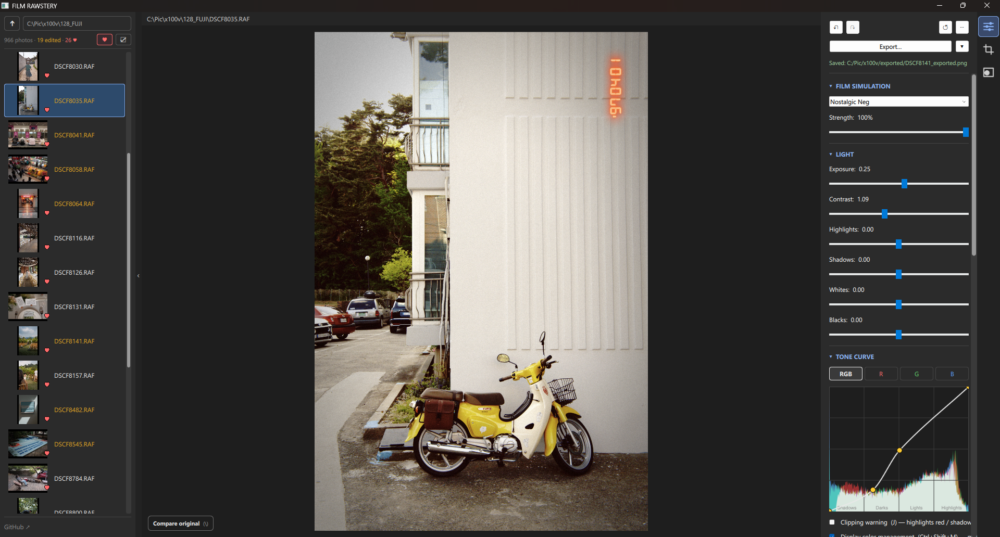
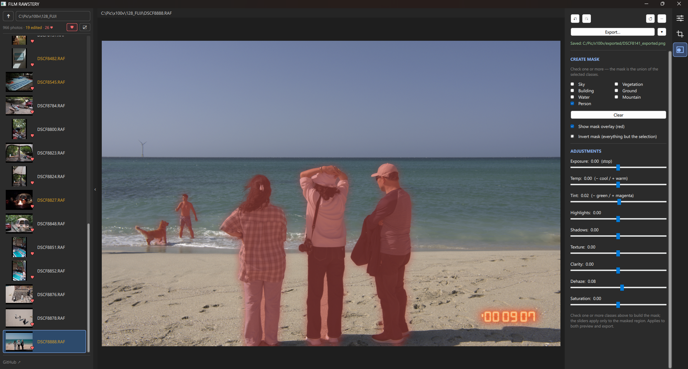
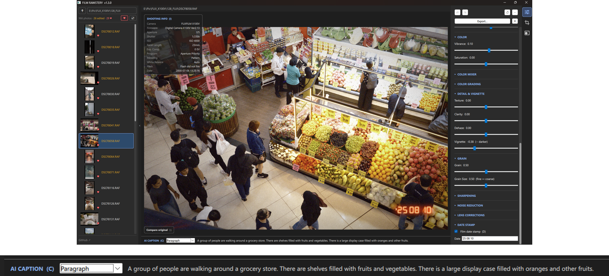

# Film Rawstery


-EB0A1E)


A GPU-accelerated RAW developer and film-simulation editor for **Fujifilm cameras** (`.RAF`), built with **PySide6 (QML) + GLSL shaders**.

Edit interactively on a real-time, shader-driven preview, then export at full resolution through a numpy pipeline that mirrors the shader exactly — *what you see is what you get*.

<p align="center">
  
  <br><br>
  
</p>

> Supports Fujifilm RAF across bodies and lenses: color matrices, white balance, and **lens corrections are all read from each file's own metadata** (the camera embeds per-shot correction tables), so no per-model profiles are needed. Developed and look-tuned primarily on an X100V.

---

## Why I built this

A hobby project, built for my own use.

I shoot a lot with the **Fujifilm X100V** and edit in Lightroom — but I only use a few of its features, so paying for a subscription felt hard to justify. Film Rawstery bundles just the features I actually need into a workflow tuned the way I like it.

Any Fujifilm body should work out of the box (everything is driven by per-file metadata); if I ever pick up another brand, I plan to add support for it too.

### The name

*Film Rawstery* is a play on **roastery**. A coffee roastery takes raw beans and roasts them into something worth drinking; this app does the same with **RAW** files — raw sensor data developed and refined into a finished photo — hence **Raw**stery. The *Film* nods to the Fujifilm film-simulation looks at its heart.

---

## Features

### Develop
- **Scene-linear + filmic** tone pipeline — physically-grounded base render with a single highlight-rolloff tone curve (no per-scene heuristics)
- **White balance** — absolute Kelvin + tint via the Planckian locus, with as-shot estimation for off-locus illuminants
- **Light** — exposure (scene-linear stops), contrast, highlights / shadows / whites / blacks (Lightroom-style local tone zones)
- **Tone curve** — Catmull-Rom editor with **per-channel RGB** curves (master + R/G/B) for color grading
- **HSL color mixer** — 8 hue bands × hue / saturation / luminance
- **Color** — vibrance & saturation
- **Detail** — texture, clarity, dehaze, and **sharpening** (amount / radius / detail / masking)
- **Noise reduction** — edge-preserving luminance NR (guided filter) + color NR, with an optional **AI denoise** base (NAFNet, auto-downloaded ~117 MB; GPU-accelerated via DirectML when available, with a confirm prompt before falling back to the much slower CPU path)
- **Effects** — film grain, vignette
- **Highlight reconstruction** — hue-aware desaturation that neutralizes clipped-highlight color casts (e.g. a fire core) while preserving saturated colored light sources (neon, signs)

### Masking (local adjustments)
- **AI selection** — ONNX semantic segmentation (SegFormer-B2 / ADE20K) detects regions to mask; the model auto-downloads on first use
- **Multi-class composite** — tick any combination of **Sky / Vegetation / Building / Ground / Water / Mountain / Person**; the mask is their union, recomposed live from a single cached inference
- **Edge-refined soft mask** — guided-filter refinement against image luminance for clean branch/edge boundaries, plus invert and a red mask overlay
- **Per-mask develop** — Exposure / Temp / Tint / Highlights / Shadows / Texture / Clarity / Dehaze / Saturation, applied only to the masked region in both preview and export
- Masks persist per-image (regenerated from the saved classes on reopen)

### AI Caption
- **On-device English captions** — Microsoft **Florence-2** running locally via ONNX (MIT-licensed model); no cloud, no account
- Captions generate automatically when a photo finishes loading and appear in a bar under the preview (toggle with `C`)
- Three detail levels — **Short / Detailed / Paragraph** — switch via the combo; each level is generated once and cached in the folder sidecar (`.filmrawsterycaptions.json`)
- The ~1.1 GB model never downloads silently: the bar offers a one-time **click-to-download opt-in**, and captions stay automatic afterwards
- ⚠️ Small-model honesty: object/people **counts can be off by one** and long captions may embellish details — treat it as a browsing aid, not ground truth

<p align="center">
  
</p>

### Film Simulations
Fujifilm looks as 3D LUTs: Provia, Velvia, Astia, Classic Chrome, Classic Negative, Nostalgic Neg, PRO Neg. Hi/Std, Eterna, Reala Ace, Bleach Bypass — with adjustable strength. The list is driven by the `.cube` files present in `luts/`, so any known LUT you drop in (e.g. B&W ACROS / Monochrome / Sepia) appears automatically, and missing ones are hidden. See [`luts/README.md`](luts/README.md) for the key filenames and where to get the B&W LUTs.

### Geometry
Crop (aspect-ratio presets + free drag), rotate / straighten, flip, and perspective (vertical / horizontal keystone + scale) — applied identically in preview and export.

### Lens Corrections
Distortion, vignetting, and chromatic aberration — applied from the **per-shot correction tables Fujifilm embeds in every RAF** (focus/aperture-aware, works for any body and lens, fixed or interchangeable). No profile database needed; files without the tags are simply left uncorrected.

### Workflow
- **Before / After compare** — toggle the unedited original (button or `\` key)
- **Undo / redo** — snapshot history of all adjustments (`Ctrl+Z` / `Ctrl+Shift+Z`)
- **Non-destructive, per-image persistence** — edits autosave to a `.filmrawsteryedits/<file>.json` sidecar and restore when you reopen the image
- **File explorer** with RAF thumbnails and a likes/favorites filter
- **Film date stamp** — DSEG7 seven-segment date back overlay
- **Live histogram** reflecting current adjustments
- **Full-resolution export** to JPEG / PNG / TIFF (background-threaded, UI stays responsive)

---

## How it works

```
RAF ──rawpy──► camera-native proxy (≤2560px, headroom-encoded)
                     │
       QML ShaderEffect pipeline (GPU, proxy-resolution FBO → scaled to screen)
       headroom-decode → WB → cam→sRGB matrix → ×2^exposure → filmic
       → tone zones → texture/clarity/dehaze → sharpen → film-sim LUT
       → vibrance/sat → HSL mixer → contrast → tone curve → mask local adjust → vignette → grain
                     │
   live preview (GPU)        Export: pipeline.py (full-res numpy, same steps)
```

Key design decisions:
- **Processing resolution ≠ display resolution** — the pipeline always renders at a fixed proxy resolution and scales to screen, so GPU load is independent of monitor size.
- **Preview = Export parity** — the GLSL shaders (`shaders/adjust.frag`) and the numpy export (`pipeline.py`) implement the same steps and formulas; strength coefficients live in a single `coeffs.py`, injected into the shader as uniforms so a change updates preview and export together.
- **Color science first, look-matching second** — algorithms are physically/colorimetrically correct; strengths and curves are then tuned to feel like Adobe Lightroom.

---

## Requirements

- Python 3.13 (3.11+ should work)
- `PySide6`, `rawpy`, `numpy`, `scipy`, `exifread`, `onnxruntime-directml` (Windows; plain `onnxruntime` elsewhere — see [`requirements.txt`](requirements.txt))
- A GPU/driver supporting the Qt RHI (OpenGL / Direct3D / Metal / Vulkan)
- AI models download on first use into a per-user data folder that survives app updates (`%LOCALAPPDATA%\FilmRawstery\models` on Windows): masking (SegFormer-B2, ~105 MB) and AI denoise (NAFNet, ~117 MB) automatically, the caption model (Florence-2, ~1.1 GB) **only after an explicit in-app opt-in** — needs an internet connection the first time (see [`models/README.md`](models/README.md))

## Install & Run

### Common setup (all platforms)

```bash
# 1. Get the source (requires git — or skip git entirely with
#    GitHub's "Code → Download ZIP" and unzip instead)
git clone https://github.com/lim8701/FilmRawstery.git
cd FilmRawstery

# 2. Create a virtual environment (recommended)
python -m venv .venv          # on macOS/Linux: python3.13 -m venv .venv

# 3. Activate it
.venv\Scripts\activate        # Windows
source .venv/bin/activate     # macOS/Linux

# 4. Install dependencies and run
pip install -r requirements.txt
python main.py
```

Open a `.RAF` from the left file explorer (double-click). Shaders auto-recompile from `shaders/*.frag` on launch when changed.

### Windows

The primary development/test platform. A prebuilt zip (no Python required) is available on the [Releases](https://github.com/lim8701/FilmRawstery/releases) page — extract and run `FilmRawstery.exe`.

### macOS

Runs from source with the common setup above — all dependencies ship prebuilt macOS wheels (Apple Silicon included), so no Xcode/compiler is needed. Notes:

- macOS ships an older system `python3`; create the venv with an explicit `python3.13` (from [python.org](https://www.python.org/downloads/)) as shown above.
- No `git`? Either accept the Command Line Tools popup when first running `git`, or use **Code → Download ZIP** on GitHub instead.
- Shaders are precompiled with Metal (MSL) included; if a recompile is triggered, the `pyside6-qsb` tool installed with PySide6 handles it automatically.
- Display color management (preview-only monitor-profile correction) is Windows-only and silently disabled on macOS — everything else works the same.
- AI denoise uses the CoreML execution provider (included in the standard `onnxruntime` macOS wheel, Apple Silicon included) and falls back to CPU — with a confirm prompt — if unavailable.
- ⚠️ **Untested in practice** — the code is written to be platform-clean, but no one has verified a real macOS run yet. If you try it, [feedback is very welcome](https://github.com/lim8701/FilmRawstery/issues).

---

## Project structure

| Path | Role |
|------|------|
| `main.py` | App entry point, controller, image providers (raw / lut / curve / stamp / thumb) |
| `raw_loader.py` | RAF → display proxy (X-Trans-safe decode, headroom encoding, lens correction) |
| `pipeline.py` | Full-resolution export — numpy reproduction of the shader pipeline |
| `sky_seg.py` | ML masking engine — ONNX SegFormer multi-class segmentation → composite soft mask |
| `ai_denoise.py` | AI denoise engine — ONNX NAFNet tiled inference, DirectML-accelerated (luminance NR base) |
| `caption.py` | AI caption engine — ONNX Florence-2 on-device English captions (self-contained BPE tokenizer) |
| `app_dirs.py` | Per-OS user-data model store (survives updates; migrates legacy downloads by copy) |
| `coeffs.py` | Single source of truth for adjustment strength coefficients (shader uniforms + pipeline) |
| `wb.py` | White balance (Kelvin/tint), cam→sRGB matrix, filmic curve, auto-exposure |
| `lens.py` | Lens corrections from RAF-embedded per-shot metadata (distortion / vignetting / CA) |
| `lut.py`, `make_luts.py` | `.cube` 3D LUT loading / baking |
| `date_stamp.py`, `exif_info.py` | Film date-back rendering / EXIF extraction |
| `ui/*.qml` | UI (Main / CurveEditor / PreviewWindow / Splash / FilmStrip) |
| `shaders/adjust.frag` | Main develop pipeline (fragment shader) |
| `shaders/blur.frag`, `shaders/convert.frag` | Separable blur (local contrast) / display-space base |
| `luts/*.cube` | Film-simulation LUTs |

---

## License

A hobby project — shared so others can use and learn from it.

- **Source code & original assets** — [MIT](LICENSE). Use, modify, and redistribute freely (including commercially).
- **Film-simulation LUTs** (`luts/*.cube`) — **CC BY-NC-SA 4.0** (attribution · **non-commercial** · share-alike), derived from [FujifilmCameraProfiles](https://github.com/abpy/FujifilmCameraProfiles); see [`luts/LICENSE`](luts/LICENSE). The code is reusable commercially, but the bundled LUTs are not.
- **AI models** — downloaded at runtime under their own licenses: the masking model is research-oriented (verify before commercial use); the caption model (Florence-2) and denoise model (NAFNet) are MIT. See [`models/README.md`](models/README.md).

> Bundled third-party components keep their own licenses; the MIT grant covers this project's own code and assets only.

---

## Credits

- **Film-simulation LUTs** — derived from the [*FujifilmCameraProfiles*](https://github.com/abpy/FujifilmCameraProfiles) project (sRGB `.cube`), licensed CC BY-NC-SA 4.0
- **Date-back font** — [DSEG](https://github.com/keshikan/DSEG) by Keshikan (SIL Open Font License 1.1)
- **Masking model** — SegFormer-B2 finetuned on ADE20K, ONNX export by [Xenova](https://huggingface.co/Xenova/segformer-b2-finetuned-ade-512-512) (transformers.js). ⚠️ Research-oriented license — verify before commercial use; see [`models/README.md`](models/README.md)
- **Caption model** — [Florence-2-base-ft](https://huggingface.co/microsoft/Florence-2-base-ft) by Microsoft (MIT), ONNX export by [onnx-community](https://huggingface.co/onnx-community/Florence-2-base-ft)
- **Denoise model** — [NAFNet](https://github.com/megvii-research/NAFNet) SIDD-width32 by megvii-research (MIT), converted to ONNX for this project
- **ONNX inference** — [ONNX Runtime](https://onnxruntime.ai/)
- **RAW decoding** — [rawpy](https://github.com/letmaik/rawpy) / LibRaw
- **UI & GPU pipeline** — [Qt for Python (PySide6)](https://doc.qt.io/qtforpython/)
- Plus [NumPy](https://numpy.org/), [SciPy](https://scipy.org/), and [ExifRead](https://github.com/ianare/exif-py)
